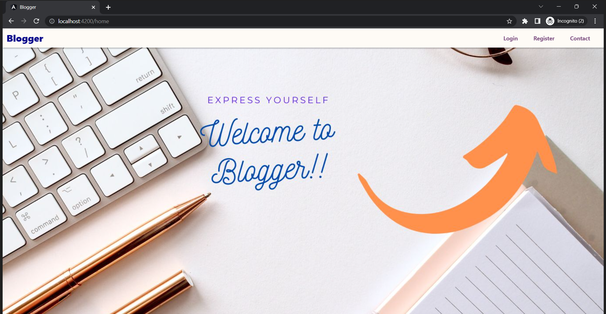
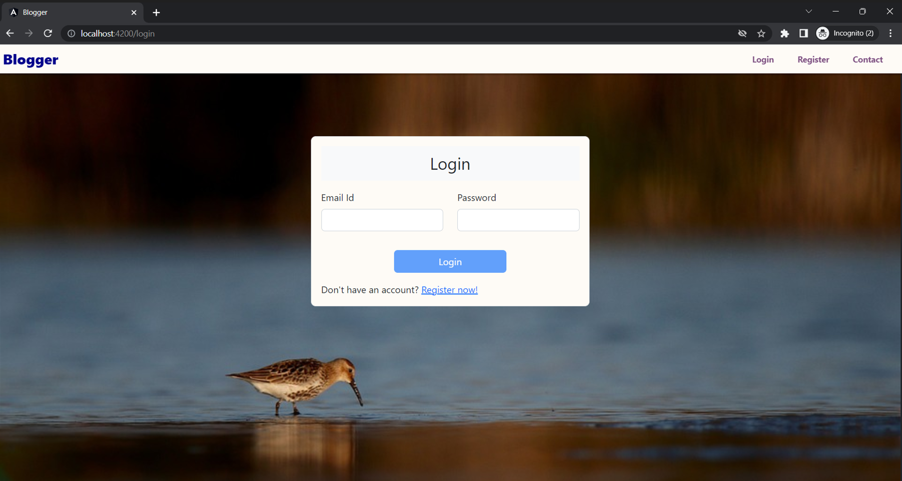
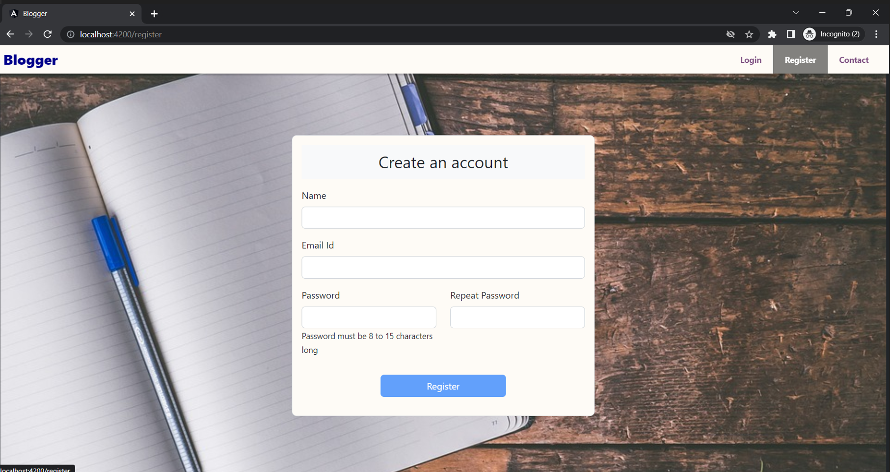
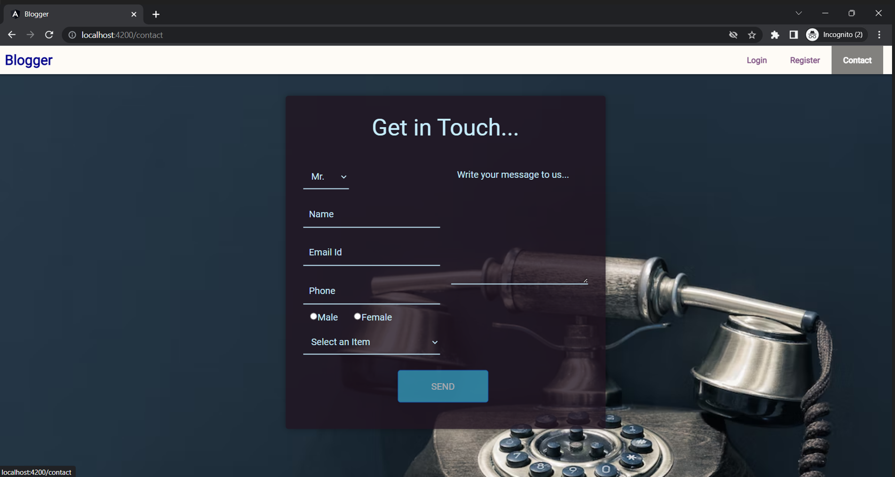
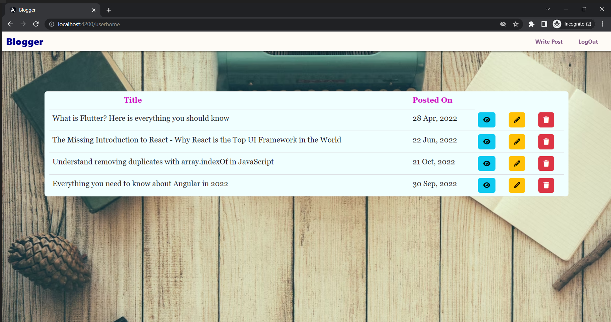
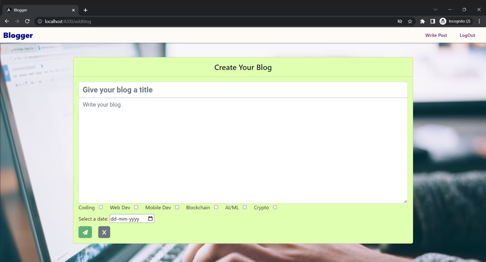
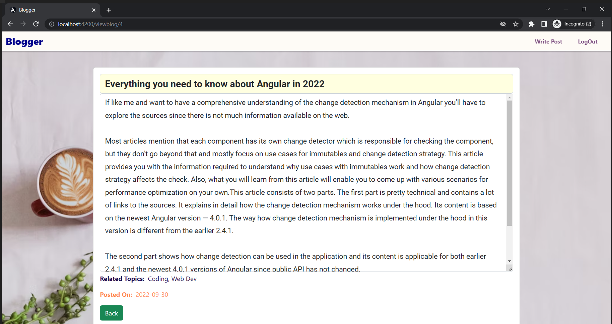

# Blogger

Thank you for checking out this project.

Welome to "Blogger" - a web app for blogging.

This web app is made using Angular 14 and Asp.Net WebApi.

## Features:

1. Create user, login and logout
2. SHA-256 password encryption
3. CRUD operations on Blogs
4. Contact page to leave feedback/comments/suggestions
5. Client-side validations on all the forms

## Project Images:

### Landing Page

### Login Page

### Sign Up Page

### Contact Us Page

### Blog Home Page

### Create Blog Page

### Blog View

## Installation

### A) Angular

#### Development server

Run `ng serve` for a dev server. Navigate to `http://localhost:4200/`. The application will automatically reload if you change any of the source files.

#### Code scaffolding

Run `ng generate component component-name` to generate a new component. You can also use `ng generate directive|pipe|service|class|guard|interface|enum|module`.

#### Build

Run `ng build` to build the project. The build artifacts will be stored in the `dist/` directory.

### B) Asp.Net Core Web Api

Just open BloggerAPI.sln in Visual Studio and run the project.

Make sure to edit value of "server" in the appsettings.json.

### C) Database

Open the script file in Sql Server Management Studio and run the script to generate the database.
